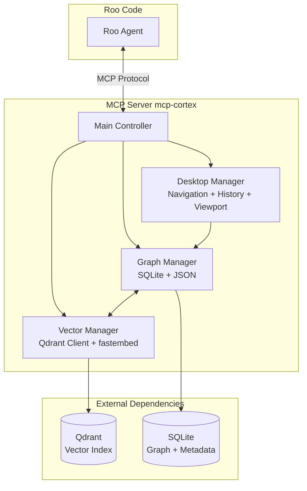
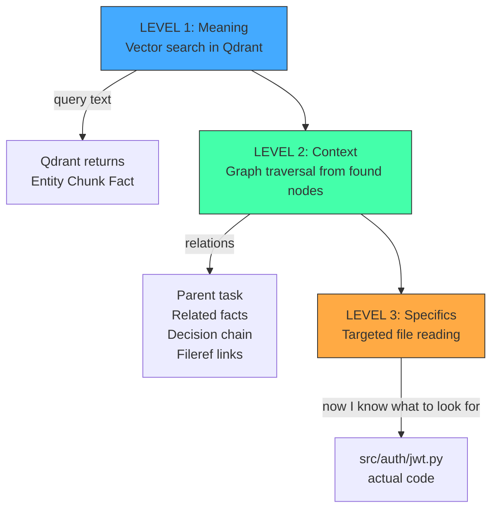
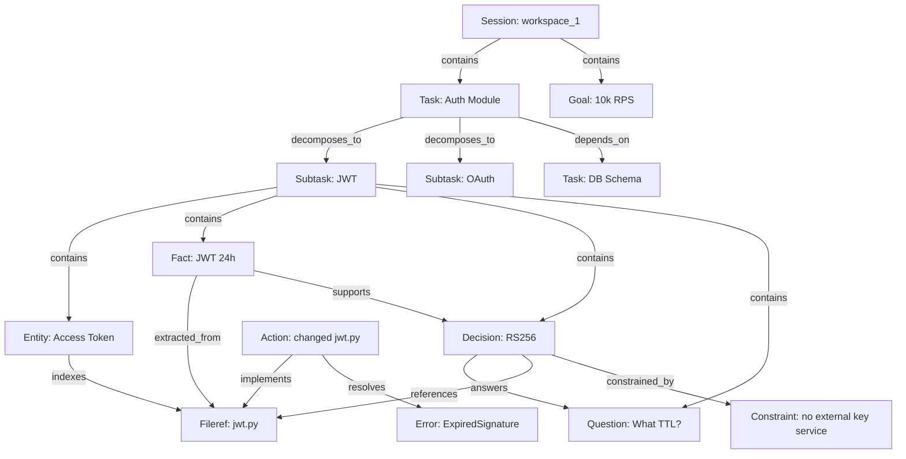
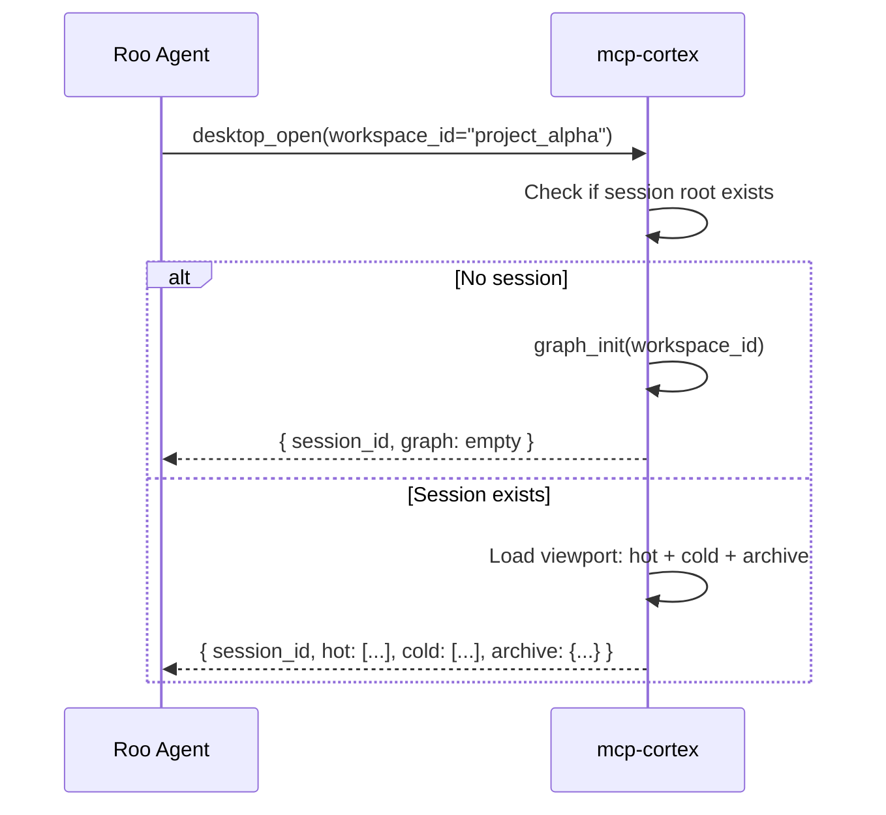
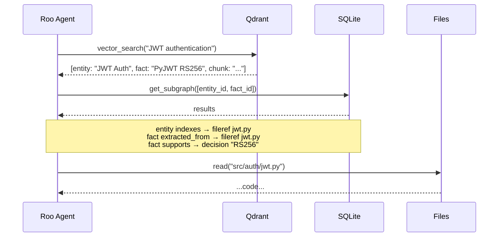
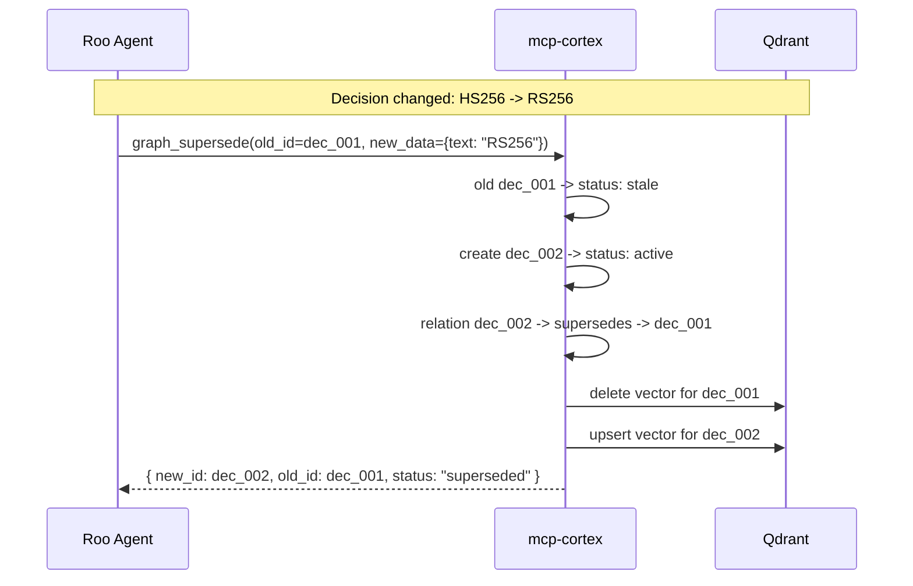

# MCP Roo Memory — Concept

> **Concept**: Graph as a workspace with subgraphs, Qdrant vector index for semantic search.
> Reasoning chains preserved as graph paths — not linear logs.
>
> **Regression Search Pattern**: First meaning (vector), then context (graph),
> then specifics (project files).

---

## 1. Philosophy

Typical AI agent memory is a dump: flat "facts" + vector chunks with no structure.
This doesn't work for complex tasks because:

- **No structure** — can't see how facts relate
- **No navigation** — can't walk a reasoning chain
- **No decomposition** — complex tasks can't be broken down in memory
- **No context** — vectors don't know which graph they live in
- **No context window control** — graph grows unbounded, token window fills up
- **No mutation** — when decisions change, stale facts linger

**MCP Roo Memory** solves this with **fractal graph memory** and four key mechanisms:

1. **Fractal Graph** (SQLite) — workspace with subgraphs, navigation, relations
2. **Multi-layer Vector Index** (Qdrant) — Entity + Chunk + Fact for semantic search
3. **Desktop Viewport** — lazy loading, Hot/Cold/Archive tiers for context window control
4. **Mutation Strategy** — Update/Supersedes/Stale-cascade for knowledge evolution
5. **Temporal Layer** — time as a first-class citizen: chronological walks, session timelines, temporal vector filters

```
┌─────────────────────────────────────────────────────────────────────┐
│                    DESKTOP VIEWPORT                                 │
│  ┌────────────────────────────────────────────────────────┐         │
│  │ HOT (always in agent context, 3-10 nodes)              │         │
│  │ ┌──────────┐ ┌──────────┐ ┌─────────────────────────┐  │         │
│  │ │ Task:    │ │ Entity:  │ │ Fact: JWT tokens        │  │         │
│  │ │ Auth     │ │ JWT Auth │ │ expire in 24h           │  │         │
│  │ └──────────┘ └──────────┘ └─────────────────────────┘  │         │
│  └────────────────────────────────────────────────────────┘         │
│  ┌────────────────────────────────────────────────────────┐         │
│  │ COLD (titles only, available via focus/search, 10-100) │         │
│  │ Task: DB Schema | Task: API Design | Subtask: OAuth... │         │
│  └────────────────────────────────────────────────────────┘         │
│  ┌────────────────────────────────────────────────────────┐         │
│  │ ARCHIVE (metadata only, 100+, via search)              │         │
│  │ 47 archived nodes (oldest: 2026-04-28)                 │         │
│  └────────────────────────────────────────────────────────┘         │
│                                                                     │
│  Vector Index (Qdrant) — multi-layer search                        │
│  Layer 1: Entities | Layer 2: Chunks | Layer 3: Facts/Decisions    │
└─────────────────────────────────────────────────────────────────────┘
```

---

## 2. System Architecture

### 2.1 Components



### 2.2 Regression Search Pattern



---

## 3. Data Model

### 3.1 Node Taxonomy (17 types)

#### Vectorized (Qdrant — semantic search)

| Type | Description | Example |
|------|-------------|---------|
| `entity` | **Concept/entity** — semantic center of gravity | "JWT Access Token", "Rate Limiter" |
| `fact` | **Knowledge/statement** | "Refresh token lives 7 days" |
| `decision` | **Architectural decision** | "Use RS256 instead of HS256" |
| `chunk` | **Fragment** of documentation/discussion/chat | "From PyJWT docs: paragraph about RS256" |
| `thought` | **Reasoning step/thought** | "Check if performance drops" |
| `question` | **Question** arising during work | "What TTL for refresh token?" |
| `hypothesis` | **Assumption/guess** | "Maybe the bottleneck is in DB indexes" |
| `action` | **Roo action** | "Changed auth/jwt.py: replaced HS256 with RS256" |
| `error` | **Error/bug** | "JWT ExpiredSignature exception" |
| `note` | **General note** | "API docs are in /docs/api.md" |
| `pattern` | **Architectural pattern** | "Repository Pattern", "CQRS" |
| `goal` | **Goal/requirement** | "System must handle 10k RPS" |
| `constraint` | **Constraint** | "Cannot use Neo4j, only SQLite" |

#### Graph-only (SQLite — not vectorized)

| Type | Description | Example |
|------|-------------|---------|
| `session` | Workspace/session root | `sess_abc` |
| `task` | Task | "Implement auth module" |
| `subtask` | Subtask | "Implement JWT" (task with parent_id) |
| `fileref` | **File reference** | `/src/auth/jwt.py` |

**Fileref** is a special node type. Contains path, file type, hash, description. Not vectorized because file search is path-based, not semantic. Connections from concepts to files go through `indexes`, `extracted_from`, `references` relations.

**Entity** — semantic concept of the project. Vectorized for meaning-based search. Connected to fileref via `indexes`.

### 3.2 Relation Taxonomy (22 types)

#### Hierarchical (tree)

| Relation | From → To | Meaning |
|----------|-----------|---------|
| `contains` | Session → Task, Task → Subtask, Task → Fact | Parent-child (fractality) |
| `decomposes_to` | Task → Subtask | Task decomposition |
| `belongs_to` | Fileref → Task | File used in task |

#### Semantic (knowledge)

| Relation | From → To | Meaning |
|----------|-----------|---------|
| `derives_from` | Fact → Chunk/Reference | Fact derived from source |
| `supports` | Fact → Decision | Fact supports decision |
| `contradicts` | Fact ↔ Fact | Facts contradict each other |
| `related_to` | Any ↔ Any | Semantically related (weak) |
| `questions` | Question → Entity/Task/Fact | Question relates to something |
| `answers` | Fact/Decision → Question | Answer to a question |

#### Index (graph as index)

| Relation | From → To | Meaning |
|----------|-----------|---------|
| `indexes` | Entity → Fileref | Concept described by file |
| `extracted_from` | Fact/Chunk → Fileref | Knowledge extracted from file |
| `references` | Decision → Fileref | Decision implemented in file |
| `implements` | Action → Fileref | Action modified file |
| `relates_to_file` | Any → Fileref | Universal file link |

#### Chronological (history)

| Relation | From → To | Meaning |
|----------|-----------|---------|
| `sequel_to` | Thought → Thought, Action → Action | Chain in time |
| `supersedes` | Decision → Decision (stale) | New decision replaced old |
| `leads_to` | Thought → Decision | Thought led to decision |
| `resolves` | Action → Error | Action fixed error |
| `triggers` | Error → Action | Error triggered action |

#### Dependency

| Relation | From → To | Meaning |
|----------|-----------|---------|
| `depends_on` | Task → Task, Subtask → Subtask | One task depends on another |
| `blocks` | Error → Task | Error blocks task |
| `constrained_by` | Decision → Constraint | Decision constrained by requirement |

### 3.3 SQLite Schema

```sql
-- Graph nodes
CREATE TABLE nodes (
    id          TEXT PRIMARY KEY,          -- UUID v4
    type        TEXT NOT NULL,             -- entity|fact|decision|chunk|thought|question|hypothesis|
                                           -- action|error|note|pattern|goal|constraint|
                                           -- session|task|subtask|fileref
    workspace_id TEXT NOT NULL,            -- workspace isolation
    parent_id   TEXT,                      -- parent node (for fractality)
    data        JSON NOT NULL DEFAULT '{}',-- flexible metadata
    status      TEXT DEFAULT 'active',     -- active|stale|archived
    created_at  TEXT NOT NULL,             -- ISO 8601
    updated_at  TEXT NOT NULL              -- ISO 8601
);

-- Graph edges
CREATE TABLE relations (
    id          TEXT PRIMARY KEY,          -- UUID v4
    from_id     TEXT NOT NULL REFERENCES nodes(id) ON DELETE CASCADE,
    to_id       TEXT NOT NULL REFERENCES nodes(id) ON DELETE CASCADE,
    type        TEXT NOT NULL,             -- contains|derives_from|references|indexes|...
    weight      REAL DEFAULT 1.0,          -- connection strength 0.0-1.0
    data        JSON DEFAULT '{}',         -- relation metadata
    created_at  TEXT NOT NULL
);

-- Navigation history (Desktop Manager)
CREATE TABLE navigation_history (
    id          INTEGER PRIMARY KEY AUTOINCREMENT,
    workspace_id TEXT NOT NULL,
    node_id     TEXT NOT NULL,
    action      TEXT NOT NULL,             -- focus|branch|traverse|search|open
    context     JSON DEFAULT '{}',         -- what led to this step
    created_at  TEXT NOT NULL
);

-- Indexes
CREATE INDEX idx_nodes_workspace ON nodes(workspace_id);
CREATE INDEX idx_nodes_parent ON nodes(parent_id);
CREATE INDEX idx_nodes_type ON nodes(type);
CREATE INDEX idx_nodes_status ON nodes(status);
CREATE INDEX idx_relations_from ON relations(from_id);
CREATE INDEX idx_relations_to ON relations(to_id);
CREATE INDEX idx_relations_type ON relations(type);
CREATE INDEX idx_nav_workspace ON navigation_history(workspace_id);
```

### 3.4 Qdrant Collection

**Collection**: `cortex_memory`

**Parameters**:
- `vectors_config`: `fastembed` auto-configure (paraphrase-multilingual-MiniLM-L12-v2, 384d)
- `sparse_vectors_config`: enabled for hybrid search (BM25-style)
- `distance`: Cosine

**Payload** (vector metadata):
```json
{
    "node_id": "uuid-of-graph-node",
    "workspace_id": "workspace-identifier",
    "node_type": "entity|fact|chunk|thought|...",
    "layer": "entity|chunk|fact",
    "tags": ["auth", "jwt", "security"],
    "status": "active|stale",
    "created_at": "2026-05-12T20:00:00Z"
}
```

**Indexing Strategy**:
- Entity, Fact, Decision, Chunk, Thought, Question, Hypothesis, Action, Error, Note, Pattern, Goal, Constraint — vectorized
- Session, Task, Subtask, Fileref — not vectorized
- When a node is deleted from the graph, its vector is removed from Qdrant
- When node text is updated, the old vector is replaced

---

## 4. Fractality: Subgraphs

Fractality is implemented through the `contains` relation:



**Fractality Rules**:

1. Any node can be a parent (have `parent_id`)
2. Subgraph = all nodes reachable via `contains` from root
3. Nesting depth is unlimited
4. A node can belong to multiple subgraphs (via different relations)

---

## 5. Temporal Layer — Time as a First-Class Citizen

**Decision**: [ADR-008 Temporal Layer](plans/ADR-008-temporal-layer.md)

Before the temporal layer, timestamps were passive metadata — written once, never queried. The graph had no time axis; the agent could not answer "what happened in what order?" without manually parsing every node's `created_at`.

### 5.1 What Changed

| Mechanism | Before | After |
|-----------|--------|-------|
| **Relation tracking** | `updated_at` was missing | `updated_at` on every relation, auto-set |
| **Temporal indexes** | None | `(workspace_id, created_at)` and `(workspace_id, updated_at)` |
| **Chronological walk** | Manual sort by agent | `temporal_walk()` — graph nodes sorted by `created_at` ASC |
| **Session timeline** | Multiple `graph_get_node` calls | `session_timeline()` — flat event log, one call |
| **Temporal vector search** | Impossible | `time_from` / `time_to` params → Qdrant `DatetimeRange` filter |
| **Anchor** | 5 last focuses, no weight | Single deterministic `(last_focus_node_id, timestamp)` |

### 5.2 New MCP Tools

| Tool | Description |
|------|-------------|
| `temporal_walk` | Traverse graph along time axis (chronological order) |
| `session_timeline` | Flat timeline of all events in a session |

### 5.3 What It Solves

1. **Anchor** — agent knows exactly where it stopped last time. `desktop_open` returns the deterministic entry point.
2. **Sequence recall** — `temporal_walk("Show decisions leading to current architecture")` returns chronological chain.
3. **Session overview** — `session_timeline("What happened in this session?")` returns one flat list.
4. **Temporal pruning** — `vector_search(query, time_from="2026-05-14", time_to="2026-05-16")` returns only results from that window.

### 5.4 Migration

Backwards-compatible: `ALTER TABLE relations ADD COLUMN updated_at`. Old data works without changes.

---

## 6. Context Window Strategy (Desktop Viewport)

### 6.1 Three Access Tiers

| Tier | What | Size | When loaded | MCP response content |
|------|------|------|-------------|----------------------|
| **Hot** | Current focus + direct relations | 3-10 nodes | Always in `desktop_open` response | Full node data + relations |
| **Cold** | Other session nodes | 10-100 nodes | Only via `desktop_focus(node_id)` or `vector_search()` | Titles + relations, no full text |
| **Archive** | Old tasks (>7 days without focus) | 100+ nodes | Only via `vector_search()` | Metadata only: "N archived nodes, use search" |

### GC for Archiving

```python
def archive_stale_nodes(workspace_id: str, days_threshold: int = 7):
    """Moves old nodes to archive"""
    stale_nodes = sqlite.query("""
        SELECT n.id FROM nodes n
        LEFT JOIN navigation_history h ON h.node_id = n.id
        WHERE n.workspace_id = ? AND n.status = 'active'
        GROUP BY n.id
        HAVING MAX(h.created_at) < datetime('now', ?)
    """, (workspace_id, f'-{days_threshold} days'))

    for node in stale_nodes:
        sqlite.update("UPDATE nodes SET status = 'archived' WHERE id = ?", node.id)
```

---

## 7. Mutation Strategy

### Three Update Strategies

| Situation | Strategy | What happens |
|-----------|----------|--------------|
| Fixed a typo in a fact | **A: Update** | `data.text` changed, `updated_at` refreshed, vector re-indexed in Qdrant |
| Radically changed approach | **B: Supersedes** | Old node marked `status: stale`, new node created with `supersedes` relation |
| Reworked task — subtasks outdated | **C: Stale-cascade** | Child nodes get `status: stale`, on focus Roo sees a warning |

### Vector Synchronization

```python
def update_node(node_id: str, new_data: dict):
    with sqlite.transaction():
        old_node = sqlite.get("SELECT * FROM nodes WHERE id = ?", node_id)
        sqlite.update("""
            UPDATE nodes
            SET data = ?, updated_at = datetime('now')
            WHERE id = ?
        """, (json.dumps(new_data), node_id))

        # If text changed — re-index vector
        if old_node.data.get("text") != new_data.get("text"):
            text = new_data.get("text", "")
            if text:
                qdrant.delete(collection="cortex_memory",
                              points_selector=Filter(must=[FieldCondition(
                                  key="node_id", match=MatchValue(value=node_id))]))
                qdrant.add(collection="cortex_memory",
                           documents=[text],
                           metadata=[{"node_id": node_id, "workspace_id": old_node.workspace_id}])
```

---

## 8. MCP Protocol

### 8.1 Tools

#### Temporal

| Tool | Description | Parameters |
|------|-------------|------------|
| `temporal_walk` | Chronological graph traversal | `workspace_id: str, from_time: str, to_time: str, relation_type: str, limit: int=50` |
| `session_timeline` | Flat timeline of all events in a session | `workspace_id: str, from_time: str, to_time: str, limit: int=50` |

#### Graph

| Tool | Description | Parameters |
|------|-------------|------------|
| `graph_add_node` | Add a node | `parent_id: str, type: str, data: dict, workspace_id: str` |
| `graph_get_node` | Get node with relations | `node_id: str, depth: int=2` |
| `graph_add_relation` | Add a relation | `from_id: str, to_id: str, type: str, weight: float` |
| `graph_traverse` | Traverse graph from node | `start_id: str, relation: str, depth: int=3` |
| `graph_walk` | Walk along reasoning chain | `start_id: str, steps: int=5` |
| `graph_decompose` | Decompose a task | `task_id: str, subtasks: list[dict]` |
| `graph_update_node` | Update node (Strategy A: Update) | `node_id: str, data: dict` |
| `graph_supersede` | Replace node (Strategy B: Supersedes) | `old_id: str, new_data: dict` |
| `graph_delete_node` | Delete node and its vectors | `node_id: str, cascade: bool` |
| `graph_search` | Hybrid: vector + subgraph expansion | `query: str, workspace_id: str` |

#### Vector

| Tool | Description | Parameters |
|------|-------------|------------|
| `vector_store` | Store text with automatic vectorization | `text: str, metadata: dict` |
| `vector_search` | Semantic search (meaning-based) | `query: str, top_k: int=10, workspace_id: str, time_from: str, time_to: str` |
| *(no separate `vector_hybrid_search` — use `graph_search` instead)* | | |

#### Desktop

| Tool | Description | Parameters |
|------|-------------|------------|
| `desktop_open` | Open workspace session, return Hot/Cold/Archive viewport | `workspace_id: str` |
| `desktop_focus` | Focus on a node, expand its subgraph | `node_id: str, workspace_id: str` |
| `desktop_history` | Navigation history | `workspace_id: str, limit: int=20` |

### 8.2 Resources

| URI | Description |
|-----|-------------|
| `cortex://graph/{workspace_id}` | Full session graph (via `desktop_open`) |
| `cortex://node/{node_id}` | Specific node with context (via `get_subgraph`) |
| `cortex://desktop/{workspace_id}` | Current desktop viewport (via `desktop_open`) |
| `cortex://search/{query}` | Hybrid search results (via `graph_search`) |

---

## 9. Usage Scenarios

### 9.1 Starting a Session



### 9.2 Regression Search



### 9.3 Mutation (Decision Change)



---

## 10. Workspace Isolation

### 10.1 Concept

Each project can have its own **workspace** — an isolated memory space. The workspace ID is set via the `--workspace` CLI argument:

```bash
python -m src.cortex --workspace mcp-roo-memory
```

### 10.2 Resolution Chain

Workspace ID is resolved in this order ([`config.py:resolve_workspace_id()`](src/cortex/config.py)):

1. **Explicit argument** — from tool call parameters
2. **`CORTEX_WORKSPACE_ID`** environment variable (set by `--workspace` CLI arg)
3. **CWD basename** — only works in native mode (inside Docker CWD is always `/workspace`)
4. **Fallback** `"default"`

### 10.3 Write vs Search

| Tool | Without `workspace_id` | With `workspace_id` |
|------|----------------------|-------------------|
| `desktop_open`, `graph_add_node`, `vector_store` | → **caller's project** (from `CORTEX_WORKSPACE_ID`) | → specified project |
| `vector_search`, `graph_search` | → **all projects** (cross-project) | → only in specified project |

This is implemented via two helpers in [`server.py`](src/cortex/server.py):

- **`_ws(args)`** — resolves workspace for WRITE tools (always returns a concrete ID)
- **`_ws_opt(args)`** — resolves workspace for SEARCH tools (returns `None` if not explicitly provided, meaning "search everywhere")

### 10.4 Per-Project Configuration

Each project that wants isolation adds its own `.roo/mcp.json`:

```json
{
  "mcpServers": {
    "cortex": {
      "command": "docker",
      "args": [
        "exec", "-i", "cortex-mcp", "python3",
        "-m", "src.cortex", "--workspace", "your-project-name"
      ]
    }
  }
}
```

This overrides the global MCP config **only for this project**. Projects without a local `.roo/mcp.json` share the default workspace.

### 10.5 Storage

All workspaces share the same SQLite database and Qdrant collection — isolation is by `workspace_id` field:

```python
# Graph: workspace_id column in nodes table
CREATE TABLE nodes (
    workspace_id TEXT NOT NULL,
    ...
);

# Vector: workspace_id in Qdrant payload
payload = {
    "workspace_id": "mcp-roo-memory",
    ...
}
```

---

## 11. ADR Index

| ADR | Decision |
|-----|----------|
| [ADR-001](plans/ADR-001-fractal-memory.md) | Custom MCP server instead of extending existing Memory MCP |
| [ADR-002](plans/ADR-002-sqlite-graph.md) | SQLite + JSON for graph instead of Neo4j/Cayley |
| [ADR-003](plans/ADR-003-qdrant-vectors.md) | Qdrant for vectors (existing) |
| [ADR-004](plans/ADR-004-fastembed.md) | fastembed for embeddings (paraphrase-multilingual-MiniLM-L12-v2) |
| [ADR-005](plans/ADR-005-desktop-viewport.md) | Desktop Viewport: Hot/Cold/Archive for context window control |
| [ADR-006](plans/ADR-006-mutation-strategy.md) | Mutation strategy: Update/Supersedes/Stale-cascade |
| [ADR-007](plans/ADR-007-regression-pattern.md) | Regression search pattern: meaning → context → specifics |
| [ADR-008](plans/ADR-008-temporal-layer.md) | Temporal layer: time as first-class citizen, chronological walks, session timelines |

---

## 12. Conclusion

**MCP Roo Memory** is not just another vector store.
It is a **fractal graph memory** where:

- **Graph** — workspace with subgraphs, walkable and navigable
- **Vector** — multi-layer index (Entity + Chunk + Fact) for semantic search
- **Fractality** — any task decomposes into a subgraph
- **Navigation** — reasoning chain preserved as a graph path
- **Viewport** — lazy loading with Hot/Cold/Archive for context window control
- **Mutation** — Update/Supersedes/Stale-cascade for knowledge evolution
- **Temporal** — time as a first-class citizen: chronological walks, session timelines, temporal vector filters

All of this works as an MCP server for Roo Code, using existing
tools (Qdrant) and adding the missing graph structure.
