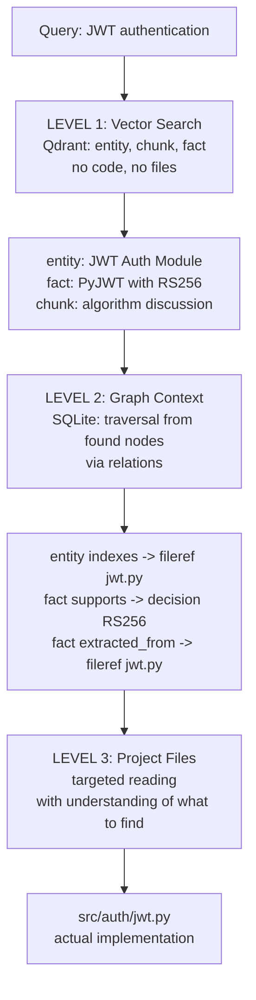

# ADR-007: Regression Search Pattern

**Status**: Accepted
**Date**: 2026-05-12
**Context**: [CONCEPT.md](../CONCEPT.md#2-system-architecture)

---

## Problem

How should the Roo Agent search for information in mcp-cortex? In what order
should it access the vector index, graph, and project files? Without a clear
pattern, Roo will either wander through files blindly or rely solely on
vector search without context.

## Options

### Option A: Flat Search — Everything at Once (rejected)

Search vectors, graph, and files simultaneously.
- Noisy, lots of duplication
- No result prioritization
- Context window fills with irrelevant data

### Option B: Files → Graph → Vector (rejected)

Start with project files, then build the graph.
- Blind wandering through files
- No understanding of "what to look for" at the start
- Roo wastes tokens on irrelevant code

### Option C: Regression — Meaning → Context → Specifics (selected)

Three sequential levels, each narrower than the previous:

1. **Meaning** (vector search in Qdrant) — find relevant facts
2. **Context** (graph traversal) — understand where those facts live
3. **Specifics** (file reading) — verify/validate with code

## Decision

### Search Pattern

### What's in the Vector vs. What's Not

| In Vector (Qdrant) | Not in Vector |
|--------------------|---------------|
| Facts: "JWT expires in 24h" | Full project files |
| Decisions: "Use RS256" | Directory structure |
| Concepts: "JWT Auth Module" | Config files |
| Thoughts/questions | Implementation code |
| Documentation fragments | — |

### Rules

1. Roo **starts** with vector search — gets semantic results
2. Expands subgraph from found nodes — gets context
3. Only then reads project files — targeted and purposeful
4. After reading/changing code — creates/updates facts in the graph

## Consequences

- Vector (Qdrant) — index, not storage
- Graph (SQLite) — source of truth for knowledge about code
- Files on disk — source of truth for code
- They don't duplicate, they complement each other
- Constant updating: changed code → updated facts
