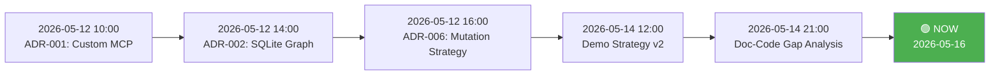

# ADR-008: Temporal Layer — Time as a First-Class Citizen

**Status**: Accepted
**Date**: 2026-05-16
**Context**: [CONCEPT.md](../CONCEPT.md), [ADR-005 Desktop Viewport](ADR-005-desktop-viewport.md), [ADR-006 Mutation Strategy](ADR-006-mutation-strategy.md), [ADR-007 Regression Pattern](ADR-007-regression-pattern.md)

---

## Problem

The graph stores timestamps (`created_at`, `updated_at`) on every node and relation, but they are passive metadata — written once, never queried structurally. Three critical agent capabilities depend on time:

1. **Anchor** — where did the agent stop last time? Without a temporal layer, `desktop_focus` cannot determine the "last position" deterministically.
2. **Sequence recall** — what happened in what order? How did decisions build on each other over time?
3. **Temporal pruning** — what is outdated not by status but by time? `archive_stale_nodes` already uses dates, but it's the only time-based mechanism.

Without a proper temporal layer, the graph remains "flat" — relationships exist, but there is no time axis to navigate.

## Options

### Option A: Keep Status Quo (rejected)

Only `created_at` / `updated_at` as strings, no indexes, no time-range API.

- Cannot answer "what happened in the last hour"
- Cannot filter vector search by time
- Session timeline must be assembled manually from `get_nav_history` without aggregation
- Anchor point — only via `get_last_focus_nodes` (5 nodes, no weight)

### Option B: Minimal — Indexes + `updated_at` on Relations (baseline)

Add:
- SQLite indexes on `(workspace_id, created_at)` and `(workspace_id, updated_at)`
- `updated_at` column on `Relation` table
- Time-range parameters on `graph_get_node` and `vector_search`

- Covers 80% of needs
- Migration: `ALTER TABLE relations ADD COLUMN`, `CREATE INDEX`
- Does not touch the data model — only indexes and API

### Option C: Full Temporal — Versioning + Point-in-Time (rejected)

Store full history of every node change (Event Sourcing style).

- Can rewind to any point in time
- Massive write and storage overhead
- Overkill for MVP — 17 node types × versions = combinatorial explosion

### Option D: Temporal Walks — Chronological Graph Traversal (selected as complement to B)

Add to Option B:
- `temporal_walk` — traverse the graph sorted by `created_at` (chronological order)
- `session_timeline` — flat timeline of all events in a session
- Deterministic anchor — `last_focus` with timestamp, single deterministic entry point
- Qdrant `DatetimeRange` filter on `created_at`

## Decision

### Strategy: Option B + D — indexes + relation `updated_at` + temporal API

### 1. Add `updated_at` to Relations

**Current:**
```python
class Relation(BaseModel):
    ...
    created_at: str  # exists
    # updated_at: str — missing
```

**Target:**
```python
class Relation(BaseModel):
    ...
    created_at: str
    updated_at: str = Field(default_factory=lambda: datetime.now(timezone.utc).isoformat())
```

SQLite migration:
```sql
ALTER TABLE relations ADD COLUMN updated_at TEXT NOT NULL DEFAULT '';
UPDATE relations SET updated_at = created_at;
```

API: `graph_update_relation()` sets `updated_at` on every call.

### 2. Temporal Indexes

```sql
CREATE INDEX IF NOT EXISTS idx_nodes_created ON nodes(workspace_id, created_at);
CREATE INDEX IF NOT EXISTS idx_nodes_updated ON nodes(workspace_id, updated_at);
CREATE INDEX IF NOT EXISTS idx_nav_created ON navigation_history(workspace_id, created_at);
```

### 3. Time-Range Query API

Temporal filter parameters added to existing methods:

```
vector_search(query, time_from="2026-05-14T00:00:00Z", time_to="2026-05-16T00:00:00Z")
  → Qdrant Filter with DatetimeRange on created_at

desktop_history(workspace_id, time_from, time_to, limit=100)
  → time-sliced navigation history
```

Qdrant filter:
```python
Filter(
    must=[
        FieldCondition(
            key="created_at",
            range=DatetimeRange(
                gte="2026-05-14T00:00:00Z",
                lte="2026-05-16T00:00:00Z"
            )
        )
    ]
)
```

### 4. Temporal Walk

New method `GraphManager.temporal_walk()` — traverses nodes in chronological order.

```python
def temporal_walk(
    self,
    workspace_id: str,
    from_time: Optional[str] = None,
    to_time: Optional[str] = None,
    relation_type: Optional[str] = None,
    limit: int = 50
) -> list[dict]:
    """
    Walk the graph along the time axis.
    Returns nodes ordered by created_at ASC within optional time range.
    Optionally filtered by node type/relation type.
    """
```

Usage: "Show me the chain of decisions that led to the current architecture, in chronological order."



### 5. Session Timeline

New method `DesktopManager.timeline()` — flat temporal log of a session.

```python
def timeline(
    self,
    workspace_id: str,
    from_time: Optional[str] = None,
    to_time: Optional[str] = None,
    limit: int = 50
) -> list[dict]:
    """
    Linear timeline of everything that happened in a session:
    - nodes created
    - navigation events (focus, branch, open)
    
    All merged and sorted by created_at ASC.
    """
```

Agent can now ask "what happened in this session?" and get a single flat response instead of multiple calls.

### 6. Deterministic Anchor

**Current mechanism**: `get_last_focus_nodes(limit=5)` — 5 last focuses without weight.

**New mechanism**:
- `last_focus` — single most recent `focus` action in `navigation_history`
- `anchor` = `(last_focus_node_id, created_at)` — deterministic
- On `desktop_open()`: if `last_focus` exists → it becomes the first hot node
- If `last_focus` is stale → warning + fallback to previous focus

```python
def get_anchor(self, workspace_id: str) -> Optional[tuple[str, str]]:
    """Get the deterministic anchor point: node_id + timestamp."""
    row = self.conn.execute(
        """SELECT node_id, created_at FROM navigation_history
           WHERE workspace_id = ? AND action = 'focus'
           ORDER BY created_at DESC LIMIT 1""",
        (workspace_id,),
    ).fetchone()
    return (row["node_id"], row["created_at"]) if row else None
```

### 7. Qdrant Temporal Filter

Add `time_from` / `time_to` to `vector_search()`:

```python
def search(
    self,
    query: str,
    workspace_id: Optional[str] = None,
    time_from: Optional[str] = None,
    time_to: Optional[str] = None,
    top_k: int = 10,
) -> list[dict]:
    """Vector search with optional temporal filter."""
    must_conditions = []
    if workspace_id:
        must_conditions.append(
            FieldCondition(key="workspace_id", match=MatchValue(value=workspace_id))
        )
    if time_from or time_to:
        range_kwargs = {}
        if time_from:
            range_kwargs["gte"] = time_from
        if time_to:
            range_kwargs["lte"] = time_to
        must_conditions.append(
            FieldCondition(key="created_at", range=DatetimeRange(**range_kwargs))
        )
    query_filter = Filter(must=must_conditions) if must_conditions else None
    # ... search with filter
```

## Consequences

### Positive
1. **Anchor**: deterministic session entry point — `last_focus` + timestamp
2. **Sequence**: `temporal_walk()` reconstructs decision chronology
3. **Session timeline**: flat event log — instant answer to "what happened"
4. **Temporal vector search**: results relevant to a time window
5. **Relation tracking**: `updated_at` on relations tracks when relationships changed
6. **Migration**: backwards-compatible — old data works without changes

### Negative
1. **Database size**: indexes add ~20-30% to SQLite size
2. **New API surface**: each method gains 2 new parameters (`time_from` / `time_to`)
3. **Qdrant version**: `DatetimeRange` requires Qdrant >= 1.9 — compatibility must be verified

### Migration Path

```sql
-- Step 1: updated_at for relations
ALTER TABLE relations ADD COLUMN updated_at TEXT NOT NULL DEFAULT '';
UPDATE relations SET updated_at = created_at;

-- Step 2: Temporal indexes
CREATE INDEX IF NOT EXISTS idx_nodes_created ON nodes(workspace_id, created_at);
CREATE INDEX IF NOT EXISTS idx_nodes_updated ON nodes(workspace_id, updated_at);
CREATE INDEX IF NOT EXISTS idx_nav_created ON navigation_history(workspace_id, created_at);

-- Step 3: Update _create_schema() in db.py for new databases
```

### Code Changes Summary

| File | Change |
|------|--------|
| `src/cortex/models.py` | Relation: add `updated_at` field |
| `src/cortex/db.py` | `_create_schema()`: new indexes; `create_relation()`: write `updated_at`; new methods `time_range_query`, `get_anchor`, `update_relation` |
| `src/cortex/graph.py` | New method `temporal_walk()` |
| `src/cortex/desktop.py` | New method `timeline()`; `open()`: deterministic anchor |
| `src/cortex/vector.py` | `search()`: `time_from` / `time_to` params with Qdrant `DatetimeRange` |
| `src/cortex/server.py` | New MCP tools: `temporal_walk`, `session_timeline`; time-range params on existing tools |

## Related ADRs

- [ADR-001](ADR-001-fractal-memory.md): Fractal Memory — base architecture
- [ADR-002](ADR-002-sqlite-graph.md): SQLite + JSON for graph — where data lives
- [ADR-005](ADR-005-desktop-viewport.md): Desktop Viewport — Hot/Cold/Archive tiers
- [ADR-006](ADR-006-mutation-strategy.md): Mutation Strategy — stale-cascade, status changes
- [ADR-007](ADR-007-regression-pattern.md): Regression Pattern — search: meaning → context → specifics
